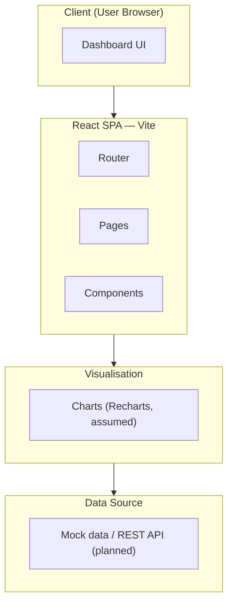
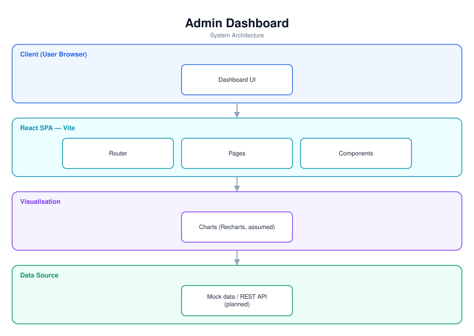

# Admin Dashboard — Software Documentation

> A responsive React admin dashboard with data visualisation (early scaffold).

**Repository:** [`admin-dashboard`](https://github.com/Monametsi-s/admin-dashboard)  
**Type:** Single-page web application  
**Status:** Early scaffold

---

## 1. Overview

Admin Dashboard is intended as a scalable, responsive React admin interface for enterprise-style applications, featuring data visualisation, charts, and user management. The current repository is an early scaffold (Vite + React + TypeScript) with a basic page/component structure; this document describes the intended architecture as a target to build toward.

## 2. System Architecture

The diagram below shows the high-level architecture and how data flows between layers. It renders automatically on GitHub (Mermaid) and is also committed as a vector image ([`architecture.svg`](architecture.svg)).



<p align="center"></p>

### 2.1 Component responsibilities

| Layer | Responsibility |
|---|---|
| **Client** | Renders dashboard pages and widgets. |
| **React SPA (Vite)** | Routing, pages, and reusable components. |
| **Visualisation** | Chart components for data viz (assumed Recharts). |
| **Data source** | Mock data now; a REST API integration is the target. |

## 3. Technology Stack

| Area | Technology |
|---|---|
| Framework | React + TypeScript |
| Build | Vite |
| Charts | Recharts (assumed) |
| Routing | React Router (assumed) |

## 4. Assumed User Requirements

_These requirements are inferred from the project's purpose and feature set; they document the intended behaviour rather than a formally agreed specification._

### 4.1 Functional requirements

- **FR-01** — Present a dashboard layout with navigation.
- **FR-02** — Render charts and data-visualisation widgets.
- **FR-03** — Provide user-management views.
- **FR-04** — Support responsive layouts.
- **FR-05** — Load data from a configurable source.

### 4.2 Representative user stories

- As an admin, I want an at-a-glance view of key metrics.
- As an admin, I want to manage users from one place.
- As an admin, I want the dashboard to work on a tablet.

### 4.3 Non-functional requirements

- The dashboard must be responsive.
- Components should be reusable and typed.
- Charts should render performantly.

## 5. Assumed System Requirements

### 5.1 End-user (runtime) requirements

- A modern desktop or mobile web browser (latest Chrome, Edge, Firefox, or Safari) with JavaScript enabled.
- A stable internet connection for the initial page load.

### 5.2 Server / hosting requirements

- A static host for the built SPA (any CDN/static host).

### 5.3 External services & API keys

- A backend/REST API for real data (planned).

### 5.4 Developer / build requirements

- Node.js 18+ and npm (or yarn/pnpm).
- Git for cloning the repository.
- A code editor such as VS Code (recommended).

## 6. Data Model

Currently mock/in-memory data; target model depends on the chosen backend (users, metrics, etc.).

## 7. Setup & Installation

```bash
git clone https://github.com/Monametsi-s/admin-dashboard.git
cd admin-dashboard
npm install
npm run dev
```

## 8. Assumptions & Future Considerations

- Build at least one real dashboard page with a chart library and mock data.
- Replace the default Vite README with a project README + screenshot.
- Integrate a data source.

---

<sub>This document was generated as part of a portfolio-wide documentation pass. User and system requirements are **assumed** from the codebase, README, and project intent, and should be validated against real product goals before being treated as authoritative.</sub>
